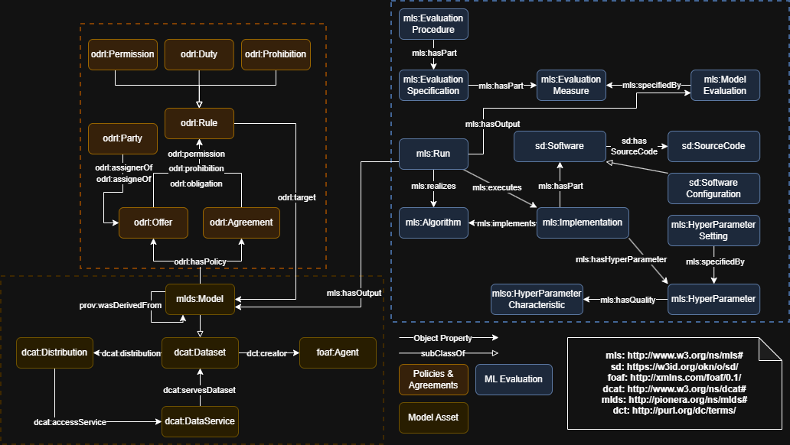

# DAIMO Ontology

DAIMO is an ontology for managing AI models in data spaces. It represents AI models as governed assets that can be published, discovered under policy constraints, invoked through data services, traced through execution, and compared through contextualized evaluation and reproducibility evidence.

This repository is a curated publication-oriented version of the DAIMO working repository. It keeps the ontology, validation materials, examples, reproducibility evidence, diagrams, and article PDFs, while removing drafts, internal notes, and non-essential working files.

The repository is prepared for a two-phase publication strategy:

1. Publish the current ontology repository in GitHub and process it with Ontoology without changing the current namespace.
2. If the thesis and publication strategy later require leaving PURL, perform a controlled namespace migration to a persistent `w3id` namespace and republish the updated ontology.



## Why this repository matters

DAIMO contributes an operational semantic model for AI model exchange in governed environments. More specifically, the repository provides:

- An ontology that integrates catalog, provenance, policy, and machine-learning semantics for AI model assets.
- An executable validation workflow based on SHACL and SPARQL competency questions.
- Reproducibility materials that back the example evaluations reported in the paper.

This makes the repository suitable for article publication support, reuse by other researchers, and inspection by organizations interested in governed AI model management.

## Included contents

| Path | Purpose |
|---|---|
| `ontology/daimo.ttl` | Canonical DAIMO ontology in Turtle |
| `ontology/daimo.owl` | RDF/XML serialization of the DAIMO ontology |
| `ontology/README.md` | Notes on the maintained ontology serializations |
| `shapes/daimo.shacl.ttl` | SHACL constraints for structural validation |
| `examples/daimo-example.ttl` | Example knowledge graph used in validation and demonstration |
| `queries/` | Executable competency questions as SPARQL queries |
| `scripts/validate.py` | End-to-end ontology validation script |
| `reproducibility/` | Notebooks, generated results, audit logs, executed notebooks, and integrity evidence |
| `diagrams/` | Ontology diagram in PNG and Draw.io source |
| `paper/` | English and Spanish PDF versions of the article |

## Current canonical namespace

The ontology currently uses the namespace:

`http://purl.org/pionera/daimo#`

For the first public Ontoology release, this namespace should be kept unchanged so that publication, validation, and generated documentation can be checked on a stable version of the ontology.

Important distinction:

- GitHub is the source repository for ontology engineering and publication materials.
- Ontoology generates documentation, diagrams, and evaluation artifacts from the repository.
- Ontoology documentation URLs are not, by themselves, the ontology namespace.

If a post-publication namespace migration is required, the recommended target is another persistent identifier such as a `w3id` namespace, not an `ontoology.linkeddata.es` documentation URL.

## Quick start

Create and activate a Python environment, then install dependencies:

```bash
python -m venv .venv
source .venv/bin/activate
pip install -r requirements.txt
```

Validate the ontology artifacts:

```bash
python scripts/validate.py
```

Run the publication preflight checks again before pushing to GitHub:

```bash
python scripts/validate.py
```

Execute the reproducibility package:

```bash
python reproducibility/execute_reproducibility_package.py
```

## Expected validation results

The current repository is expected to satisfy the following checks:

- The ontology in Turtle and RDF/XML, the SHACL shapes, the SPARQL manifest, and the example graph parse correctly.
- The Turtle and RDF/XML ontology serializations are graph-equivalent.
- Meta-SHACL validation passes.
- The example graph conforms to the SHACL constraints.
- Fourteen competency questions execute successfully.
- The reproducibility package regenerates the reported evaluation outputs.
- The observed accuracies remain `0.89` for `Model1` and `0.82` for `Model2`.

## Competency-question coverage

The SPARQL validation suite covers:

- Registration and publication
- Discovery and policy-aware selection
- Execution and auditability
- Evaluation and reproducibility

The expected result thresholds for each query are declared in `queries/manifest.json`.

## Repository layout

```text
daimo-ontology_v2/
├── ontology/
├── shapes/
├── examples/
├── queries/
├── scripts/
├── reproducibility/
├── diagrams/
├── paper/
├── docs/
├── .github/workflows/
├── CITATION.cff
├── README.md
└── requirements.txt
```

## Using this repository with Ontoology

If you want to publish DAIMO documentation with Ontoology, read:

- [`docs/ontoology-publication.md`](docs/ontoology-publication.md)
- [`docs/namespace-migration-plan.md`](docs/namespace-migration-plan.md)

In short:

- Phase 1: publish this repository with the current PURL namespace and process it in Ontoology.
- Phase 2: if required, migrate the namespace in a coordinated way and republish a new version.

## Included paper

The repository includes the article PDFs:

- `paper/daimo-paper-en.pdf`
- `paper/daimo-paper-es.pdf`

These documents explain the ontology, methodology, validation strategy, scenarios, and research contribution in publication-ready form.

## Recommended next publication steps

Before making the repository public, the remaining recommended actions are:

1. Add the final repository license.
2. Connect the repository to Ontoology.
3. Review and merge the documentation pull request generated by Ontoology.
4. Decide whether the namespace should remain at PURL or later migrate through a controlled release.

As verified on the Ontoology homepage on April 4, 2026, repositories must be submitted in the form `user/repository`, and repositories in GitHub organizations are reported as not currently supported.

## Authors

- Edmundo de Elvira Mori Orrillo
- Jiayun Liu

## Contact

For questions about the ontology or repository, contact:

- `edmundo.mori.orrillo@upm.es`
